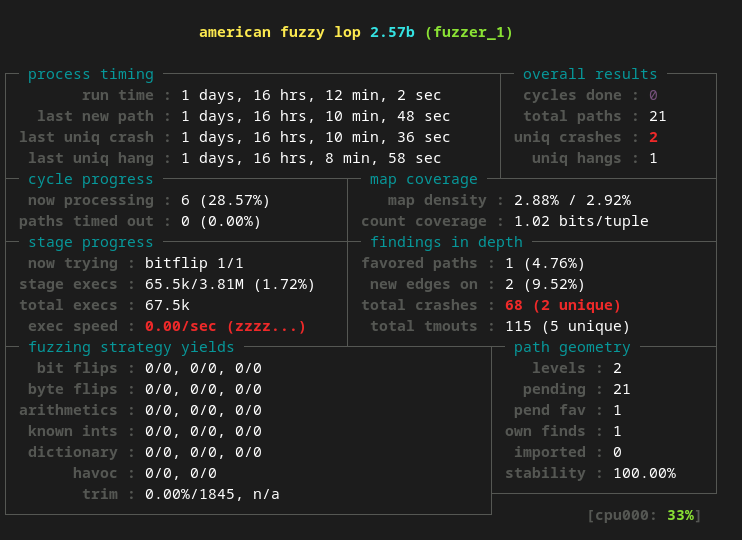
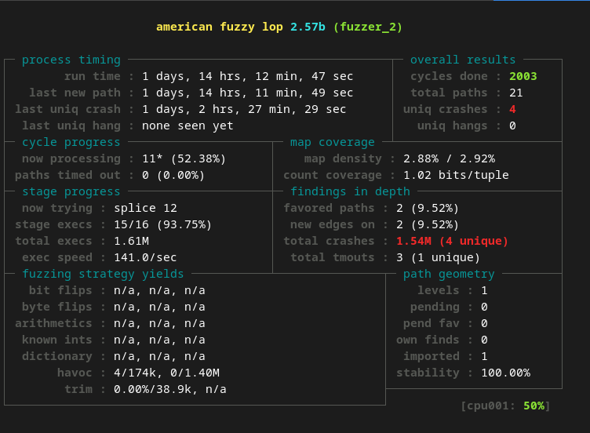
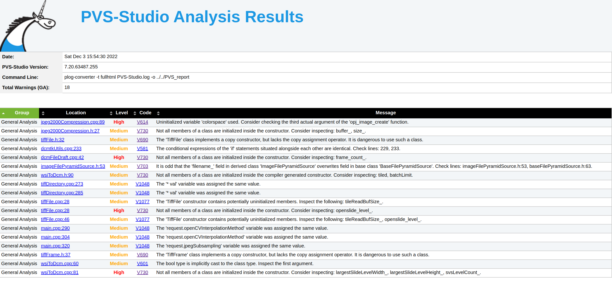

# Домашние работы по спецкурсу "Математические модели вычислений"

## Задача 1.1 *. Рецензия на фрагмент кода одногруппника объёмом не менее 100 строк. Код должен представлять законченный фрагмент функциональности. Оформить рецензию в форме комментариев к коду.

В качестве кода для Code Review я использовал одну из домашних работ одногруппника. Оригинальный код можно найти здесь: https://github.com/ostapello/candys.
Данная программа реализует апроксимацию функции 1ой переменной сплайнами и интерполяционными многочленами.

Проект с комментариями к коду находиться в папке /hw_1/1_1/candys/1D_Approximation.
Так же коммит с комментариями можно посмотреть в https://github.com/ostapello/candys/compare/main...SibgatullinAP:candys:main

## Задача 1.2 **. Отправить pull-request в существующий проект с открытым исходным кодом, в котором используют рецензирование (принимается ретроспектива, т.е. если вы ранее уже такое делали).

В качестве проекта с открытым исходным кодом я использовал: https://github.com/GoogleCloudPlatform/wsi-to-dicom-converter. Это конвертер WSI в DICOM, который используется для обработки медицинских изображений.

C помощью PVS Studio я нашел несколько ошибок и решил их исправления отправить через PullRequest (https://github.com/GoogleCloudPlatform/wsi-to-dicom-converter/pull/108)

## Задача 1.4б ***. Выполнить fuzzing-тестирование для проекта с открытым исходным кодом.

В качестве проекта с открытым исходным кодом я использовал: https://github.com/GoogleCloudPlatform/wsi-to-dicom-converter. Это конвертер WSI в DICOM, используется для обработки медицинских изображений.

В качестве инструмента для fuzzing-тестирования я использовал AFL (https://github.com/google/AFL). Для тестовых данных я брал медицинские изображения формата WSI с открытой базы данных National Cancer Institute (https://gdc.cancer.gov/). Начальная тестовая выборка состояла из 20 корректных изображений. 

На изображениях ниже можно увидеть информацию о времени работы Fuzzer'ов и количество падений, которые они обнаружили.

Как видно по изображениям выше fuzzer'ы нашли несколько падений, при дальнейшем анализе test-case'ов на которых, произошли падения стало ясно, что это не падения в привычном нам понимании (SIGFAULT, SIGPIPE и т.д,), а намеренное завершение работы программы, в случае некорректных  входных данных. Просто разработчики решили почему-то вместо возврата кода ошибки, посылать исключение и вызывать abort (). В итоге не смог обнаружить критических ошибок с помощью fuzzing-тестирования.

## Задача 1.5б ***. Выполнить проверку средствами статического анализа проекта с открытым исходным кодом.

В качестве проекта с открытым исходным кодом я использовал: https://github.com/GoogleCloudPlatform/wsi-to-dicom-converter.
Это конвертер WSI в DICOM, используется для обработки медицинских изображений.

В качестве статического анализатора кода я использовал https://pvs-studio.com/ru/pvs-studio/.
Результат проверки с помощью pvs-studio находится по пути: PVS_report/index.html (Его можно открыть в браузере):

Как видно по изображению выше статический анализатор обнаружил значительное количество ошибок, которые могут серьезно сказываться на логике работы программы. Так например обнаружены пути исполнения при которых некоторые переменные остаются не инициализированными. Также присутствует ошибка связанная с переопределением члена класса, который изначально был родительским. Из-за этого могут возникать нетривиальные ошибки, причину которых сложно найти.

